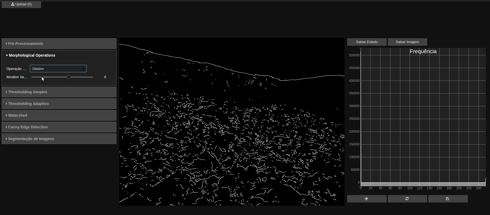

# grancv

Computer vision web application with granulometry purpouses, built on top of [ipyvuetify](https://github.com/mariobuikhuizen/ipyvuetify), [bqplot](https://github.com/bqplot/bqplot), [opencv](https://github.com/opencv/opencv-python) and [ipycanvas](https://github.com/martinRenou/ipycanvas).



## Install

Create new conda environment:

`conda create -n cv_env`

Activate environment:

`source activate cv_env`

Install some packages:

`python -m pip install -r requirements.txt`

Run the app:

`voila --VoilaConfiguration.extension_language_mapping='{".py": "python"}' $1 --debug`

Or, if you prefer the dark theme:

`voila --VoilaConfiguration.extension_language_mapping='{".py": "python"}' $1 --theme=dark --debug`

You may want to paste this into your .bash_aliases file:

```
v() {
  voila --VoilaConfiguration.extension_language_mapping='{".py": "python"}' $1 --theme=dark --debug
}
```

Now, you can run the application with:

`v index.py`

## Operations Available

You can use and tune combinations of the following operations:

- Neural Style Transfer
  
  - Select one of the available torch .t7 models available in the 'models' folder.
  
  - You can adjust the quality of the final result by changing the image width.

- Preprocessing
  
  - Filtering 
    
    - Simple
    
    - Bilateral Filtering
  
  - Blur
    
    - Simple
    
    - Median Blur 
    
    - Gaussian Blur

- Morphologycal Operations
  
  - Erosion
  
  - Dilatation
  
  - Opening
  
  - Closing
  
  - Gradient
  
  - Top Hat
  
  - Black Hat

- Thresholding
  
  - Simple
    
    - Binary
    
    - Binary Inverse
    
    - To-Zero
    
    - To-Zero Inverse
  
  - Adaptive
    
    - Adaptive mean c
    
    - Adaptive Gaussian c

## To do

This application is is very initial stage. More operations will be added to the application gradually. Here are some I've thought about:

- Possibility of creating your own operation, from the combinations of wherever you want.

- Choose (and plot) the kernel. All kernel used in the operations are matrices of kernels in the form:
  
  ```
  [[1,1,1],
  [1,1,1],
  [1,1,1]]
  ```

- Scripts to build the application.
